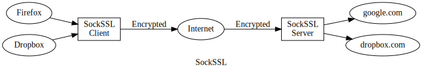

# SockSSL: secure your [SOCKS][wiki] connection using SSL



## Build from Source

Download source code

```shell
git clone https://github.com/joekyo/sockssl.git
cd sockssl
go mod init sockssl
```

Build `sockssl` on your server

```shell
go build -o sockssl cmd/server.go
./sockssl
```

Build `sockssl` on your PC or Mac or Linux

```shell
go build -o sockssl cmd/client.go
./sockssl example.com
```

## Server Side Usage

Before running `sockssl` on server, you need to prepare a valid certificate file and a private key.
You can use tools like [certbot] or [lego] to fetch a free certificate on your server.

When `sockssl` starts, it will try loading the certificate file named `fullchain.pem` and the private key named `key.pem`.
If you have these files with different names, you can use command line flags `-c` and `-k` to specify them, e.g.:

```shell
./sockssl -c /path/your_cert -k /path/your_key
```

`sockssl` will listen on default port `2080`, to change it use flag `-p`, e.g.:

```shell
./sockssl -p 8443
```

## Client Side Usage

Suppose that your server domain name is `example.com`, to connect to your server simply run

```shell
./sockssl example.com
```

`sockssl` will connect to `example.com` and its default port `2080`. If your server is listening on other port like `8443`, you can run

```shell
./sockssl example.com:8443
```

The client `sockssl` will listening on default interface `127.0.0.1` and port `1080`.
You can use command line flags `-i` and `-p` to change them respectively.
For example, to allow others at same LAN to connect your `sockssl` client, you can run

```shell
./sockssl -i 0.0.0.0 example.com
```

## Console Output

This is the output of `sockssl` on client side

```shell
17:41:46 127.0.0.1:54108 > d.dropbox.com:443
17:41:46 127.0.0.1:54108 = d.dropbox.com:443
17:42:47 127.0.0.1:54108 x d.dropbox.com:443 (937B tx, 3945B rx, 1m1s)
```

- `>` indicates a software is trying to connect to a remote server.

      In above case, it's Dropbox trying to connect to `d.dropbox.com:443`

- `=` indicates the connection has established successfully.

      Drobox client <=> Sockssl client <=> Sockssl server <=> Dropbox server

- `x` indicates the connection is now broken.

      It lasted for 1 minute and 1 second. 937 Bytes has been sent, and 3945 Byte has been received.


[wiki]: https://en.wikipedia.org/wiki/SOCKS
[certbot]: https://certbot.eff.org/
[lego]: https://github.com/go-acme/lego/
